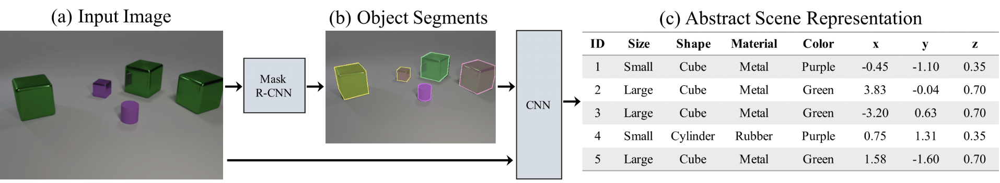

# NeuroSymbolic-vqa
1. Object-Detection on CLEVR Dataset. run the notebook ./Neuro-Symbolic-AI/Scene_Parser/samples/clevr/runPrediction_clevr.ipynb to see the demo of the object detection on CLEVR dataset.     
2. Attribute_Net to calculate the coordinates of the objects. 

  

